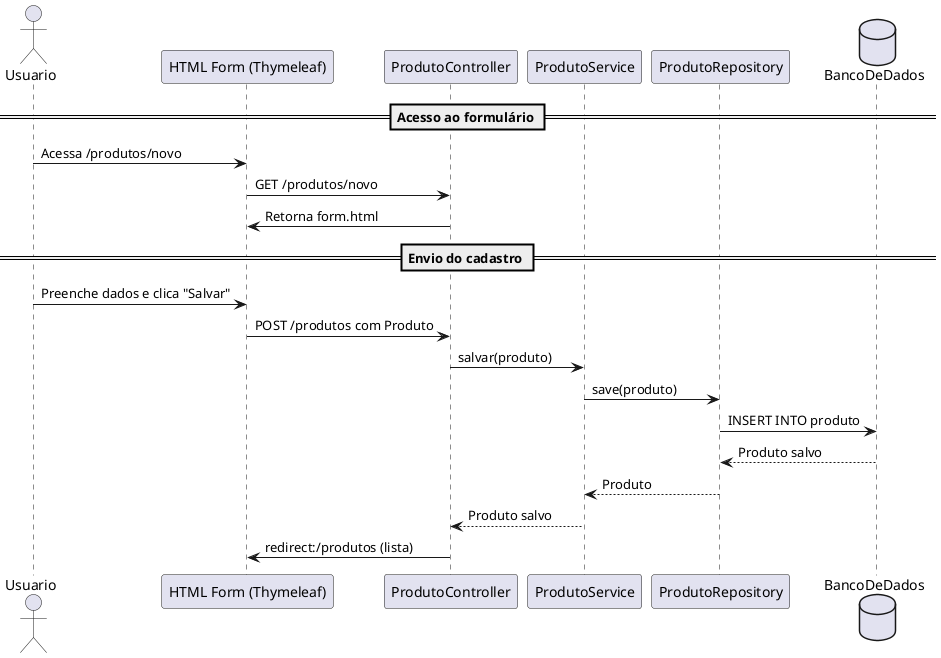

# 📦 SpringThymeleafCRUD

Um projeto didático de CRUD (Create, Read, Update, Delete) de produtos, utilizando as tecnologias:

- ✅ Spring Boot
- ✅ Spring Data JPA
- ✅ Thymeleaf (com HTML puro, sem estilização)
- ✅ MySQL
- ✅ Lombok

---

## 🧠 Objetivo

Este projeto foi desenvolvido com fins didáticos para a disciplina de **Projeto de Software**, com foco na prática de conceitos como:
- Organização em camadas (MVC)
- Integração com banco de dados
- Criação de templates com Thymeleaf
- Uso de métodos REST (incluindo `DELETE` com `fetch`)
- Mapeamento da entidade `Produto` com JPA

---

## 🛠️ Tecnologias

| Tecnologia       | Versão sugerida |
|------------------|-----------------|
| Java             | 17+             |
| Spring Boot      | 3.x             |
| Spring Data JPA  |                 |
| Thymeleaf        |                 |
| Lombok           |                 |
| MySQL            | 8.x             |
| Maven            |                 |

---

## 📐 Estrutura do Projeto

```
src/
├── main/
│   ├── java/
│   │   └── com.seuprojeto/
│   │       ├── controller/
│   │       ├── model/
│   │       ├── repository/
│   │       └── service/
│   └── resources/
│       ├── templates/
│       │   ├── lista.html
│       │   └── form.html
│       └── application.properties
```

---

## 🧾 Entidade `Produto`

```java
public class Produto {
    private Long id;
    private String nome;
    private String descricao;
    private Double valor;
    private Integer quantidade;
    private String imagem; // URL ou caminho
}
```

---

## 🔃 Funcionalidades

- [x] Listar produtos
- [x] Cadastrar novo produto
- [x] Editar produto
- [x] Deletar produto (via JavaScript `fetch` com `DELETE`)
- [x] Redirecionamento pós-salvamento
- [x] Frontend em HTML com Thymeleaf

---

## ▶️ Como executar

### Pré-requisitos

- Java 17+
- MySQL
- Maven

### Configuração do banco de dados

1. Crie o banco de dados:

```sql
CREATE DATABASE springthymeleafcrud;
```

2. Configure o arquivo `application.properties`:

```properties
spring.datasource.url=jdbc:mysql://localhost:3306/springthymeleafcrud
spring.datasource.username=root
spring.datasource.password=sua_senha
spring.jpa.hibernate.ddl-auto=update
spring.jpa.show-sql=true
```

### Rodando o projeto

```bash
./mvnw spring-boot:run
```

Acesse: [http://localhost:8080/produtos](http://localhost:8080/produtos)

---

## 🧩 Diagramas

### 📘 Diagrama de Classes

> Gerado com PlantUML
> 


### 🔁 Diagrama de Sequência - Cadastro

> POST /produtos




---

## 👤 Autor

**Herysson R. Figueiredo**  
📧 herysson.figueiredo@ufn.edu.br 
🔗 [Github](https://github.com/Herysson)

---

## 📄 Licença

Este projeto está licenciado sob os termos da **Licença MIT**.  
Veja o arquivo [LICENSE](LICENSE) para mais detalhes.


